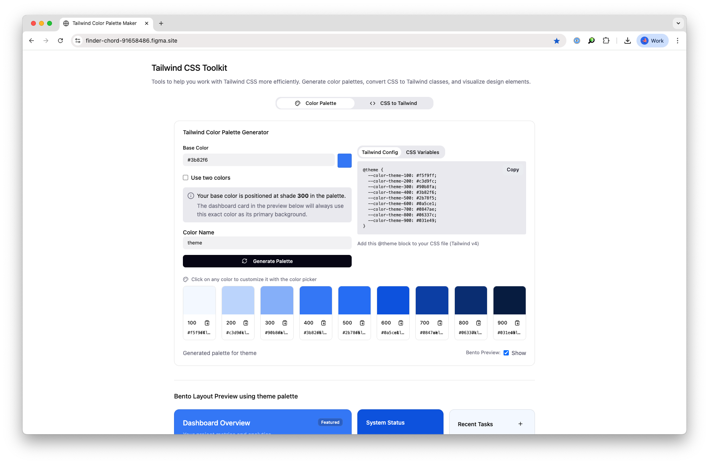

# Tailwind CSS Toolkit

A comprehensive toolkit for working with Tailwind CSS more efficiently. Generate intelligent color palettes, convert CSS to Tailwind classes, and visualize design components in real-time.



## Features

### 🎨 Color Palette Generator
- **Intelligent Color Positioning**: Automatically positions base colors in the correct shade (50-900) based on lightness analysis
- **Dual Color Mode**: Generate palettes from one or two base colors with smooth interpolation
- **Native Color Pickers**: Click any color swatch to customize with native browser color picker
- **Multiple Format Support**: View colors in both HEX and OKLCH formats
- **Tailwind v4 Output**: Generate modern `@theme` blocks with CSS custom properties
- **Live Bento Preview**: See your colors applied to real UI components instantly
- **Smart Contrast**: Automatic text color adjustment for optimal readability

### 🔧 CSS to Tailwind Converter
- **Comprehensive Property Support**: Convert a wide range of CSS properties to Tailwind classes
- **Specialized Handlers**: Enhanced conversion for borders, gradients, shadows, and measurements
- **RGBA Color Conversion**: Automatic conversion of RGBA colors to closest Tailwind equivalents
- **Arbitrary Value Fallbacks**: Uses Tailwind's arbitrary value syntax when exact matches aren't available
- **Batch Processing**: Convert multiple CSS declarations at once

### 🎯 Real-time Bento Layout Preview
- **Live Updates**: Automatically updates as you modify colors
- **Comprehensive UI Examples**: Dashboard cards, charts, forms, calendars, and more
- **Contrast Validation**: Ensures proper text readability across all color combinations
- **Responsive Design**: Preview how your colors work across different screen sizes

## Installation

### Prerequisites
- Node.js 18+ 
- npm, yarn, or pnpm

### Setup

1. **Clone the repository**
   ```bash
   git clone <repository-url>
   cd tailwind-css-toolkit
   ```

2. **Install dependencies**
   ```bash
   npm install
   # or
   yarn install
   # or
   pnpm install
   ```

3. **Start the development server**
   ```bash
   npm run dev
   # or
   yarn dev
   # or
   pnpm dev
   ```

4. **Open in browser**
   Navigate to `http://localhost:5173` (or the port shown in your terminal)

## Usage

### Color Palette Generator

1. **Choose your base color** using the color picker or enter a hex value
2. **Optional**: Enable "Use two colors" for gradient-based palettes
3. **Name your color scheme** (defaults to "theme")
4. **Generate palette** - the tool automatically positions your color intelligently
5. **Customize any color** by clicking on the color swatches
6. **Copy the output** in either Tailwind v4 @theme format or CSS variables
7. **Preview in context** using the live layout below

#### Example Output (Tailwind v4)
```css
@theme {
  --color-theme-50: #fef7ee;
  --color-theme-100: #fdedd3;
  --color-theme-200: #fbd6a5;
  --color-theme-300: #f8b86d;
  --color-theme-400: #f59332;
  --color-theme-500: #f37316;
  --color-theme-600: #e4590c;
  --color-theme-700: #bc420c;
  --color-theme-800: #963612;
  --color-theme-900: #7a2e12;
}
```

### CSS to Tailwind Converter

1. **Paste your CSS** properties into the input area
2. **Review conversions** - the tool shows both original CSS and Tailwind equivalent
3. **Copy results** to use in your project
4. **Handle edge cases** - properties that don't have direct Tailwind equivalents use arbitrary values

#### Example Conversions
```css
/* Input CSS */
background: linear-gradient(45deg, #ff6b6b, #4ecdc4);
border-radius: 12px;
box-shadow: 0 4px 6px rgba(0, 0, 0, 0.1);

/* Output Tailwind */
bg-gradient-to-br from-red-400 to-teal-400
rounded-xl
shadow-md
```

## Project Structure

```
├── App.tsx                     # Main application component
├── components/
│   ├── PaletteGenerator.tsx    # Color palette generation tool
│   ├── CssToTailwind.tsx      # CSS to Tailwind converter
│   ├── BentoLayout.tsx        # Live preview component
│   ├── ColorPicker.tsx        # Native color picker component
│   ├── ColorSwatch.tsx        # Individual color display
│   ├── figma/
│   │   └── ImageWithFallback.tsx
│   └── ui/                    # shadcn/ui components
├── utils/
│   ├── color-utils.ts         # Color manipulation and generation
│   └── css-to-tailwind.ts     # CSS conversion logic
└── styles/
    └── globals.css            # Tailwind v4 configuration and base styles
```

## Technology Stack

- **Framework**: React 18 with TypeScript
- **Styling**: Tailwind CSS v4 with custom CSS properties
- **UI Components**: shadcn/ui component library
- **Color Processing**: Custom OKLCH color space utilities
- **Icons**: Lucide React
- **Build Tool**: Vite

## Key Features Explained

### Intelligent Color Positioning
The palette generator analyzes your base color's lightness and automatically positions it in the appropriate shade:
- **Very light colors** (near white) → 50 shade
- **Mid-tone colors** → 400-600 shades  
- **Very dark colors** (near black) → 900 shade

### OKLCH Color Space
Uses OKLCH (Oklab Lightness Chroma Hue) for more perceptually uniform color generation, ensuring better color relationships across the palette.

### Tailwind v4 Support
Generates modern Tailwind v4 `@theme` blocks instead of legacy JavaScript configuration, making it easy to integrate with the latest Tailwind CSS.

## Development

### Adding New Features
1. **Color utilities**: Extend `utils/color-utils.ts`
2. **CSS conversions**: Add handlers in `utils/css-to-tailwind.ts`
3. **UI components**: Follow shadcn/ui patterns in `components/ui/`

### Customizing Styles
The project uses Tailwind v4 with CSS custom properties defined in `styles/globals.css`. Modify the `:root` and `.dark` selectors to customize the design system.

### Contributing
1. Fork the repository
2. Create a feature branch
3. Make your changes
4. Test thoroughly
5. Submit a pull request

## Browser Support

- Modern browsers with CSS custom properties support
- Chrome 49+, Firefox 31+, Safari 9.1+, Edge 16+

## License

MIT License - feel free to use this project for personal or commercial purposes.

---

**Built with ❤️ using React and Tailwind CSS v4**

*Need help or have suggestions? Open an issue or contribute to make this toolkit even better!*
